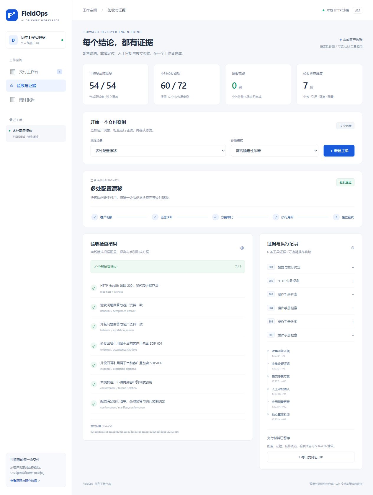

# FieldOps Agent

**AI 应用现场交付与故障诊断工作台**：把客户现象转成可追溯的诊断证据、待审批的配置更新、独立业务验证和交付材料。

[在线演示](https://jiangzheyi1234-star.github.io/fieldops-agent/) · [研究与设计依据](docs/research.md) · [测评结果](evaluation/results/report.md) · [部署与操作手册](docs/delivery.md)



## 项目解决什么问题

企业知识助手接入模型网关、知识库和导入任务后，`/health` 返回 200，客户问答仍可能失败。FDE 需要核查接口、凭据引用、超时预算、向量 schema、索引和租户访问控制，并提供可复核的交付材料。

这个原创作品实现了可执行的**本地 HTTP 服务沙箱**。配置变化会改变业务接口的实际响应；验收器在新数据库和新服务实例中重放配置，以业务回答、引用和访问控制判断是否恢复。全部数据为合成数据，没有接入真实客户或云平台。

## 已实现能力

- React / TypeScript 工作台：创建工单，查看配置差异与证据，审批方案，执行更新，查看验收和测评。
- FastAPI / SQLite：持久化工单、配置、方案、审批、工具记录与操作事件；重启后可读取待审批工单。
- 三个只读工具：配置读取、HTTP 业务探测、BM25 操作手册检索；方案绑定证据 ID 和 runbook。
- 两种诊断模式：默认**确定性离线模式**；可选 OpenAI-compatible 原生工具调用，最多 12 轮 / 20 次工具调用，模型不能直接执行变更。
- 变更审批：方案 SHA-256 + 配置版本绑定审批；仅允许交付清单规定的字段和值；重复执行和失效审批返回 409。
- 七项独立检查：存活、两类业务回答、两类引用、租户隔离、配置约定。保留需升级或人工复核的失败状态。
- 交付 ZIP：配置快照、客户约定、证据、事件、验收结果、操作说明及文件 SHA-256 清单。
- 96 个固定合成案例，24 个开发案例和 72 个测试案例；四种方法的逐例结果与操作轨迹公开。

## 测评结果

以下是**离线确定性工程回归**，不是大模型能力、真实生产故障准确率或官方 FDE-Bench 成绩。

| 方法 | 业务验收成功 | 可修复故障恢复 | 误报完成 |
| --- | --- | --- | --- |
| 仅看健康检查 | 6 / 72 | 0 / 54 | 66 |
| 单次错误匹配 | 42 / 72 | 36 / 54 | 0 |
| 移除验收门禁 | 60 / 72 | 54 / 54 | 12 |
| FieldOps 完整流程 | **60 / 72** | **54 / 54** | **0** |

剩余 12 例是上游维护和回答内容漂移。正确处理分别是升级给提供方和人工复核，不能宣称业务已恢复。该测试集覆盖已知故障模板的新参数组合，**不证明对未知生产故障的泛化能力**。详见[评估协议](evaluation/PROTOCOL.md)和[逐例结果](evaluation/results/trials.jsonl)。

## 快速运行

需要 Python 3.12+、Node.js 24+。Linux / macOS：

```bash
python -m venv .venv
source .venv/bin/activate
pip install -r requirements-dev.lock
pip install --no-deps -e .
cd web
npm ci
npm run build
cd ..
uvicorn fieldops.api:create_app --factory --host 127.0.0.1 --port 8765
```

Windows PowerShell 把激活步骤替换为 ` .\.venv\Scripts\Activate.ps1`，也可直接使用 `.venv\Scripts\python.exe`。打开 `http://127.0.0.1:8765`。开发时另开终端，在 `web` 目录运行 `npm run dev`，前端代理到端口 8765。

```bash
pytest -q
ruff check .
python -m evaluation.run --split test
python -m evaluation.check
python -m evaluation.export_demo
```

`evaluation.run`读取固定 `cases.json`，结果写入 `evaluation/results`。耗时仅是本机执行参考，模拟的上游耗时不是模型 API 延迟。

## 试演三分钟

1. 选择“多处配置漂移”，新建工单并运行诊断。查看接口路径、向量维度、导入任务和租户隔离四项差异。
2. 打开 E02，确认健康检查成功但业务请求失败。每项修复都有配置、探测和手册证据。
3. 确认方案并批准，再执行修复。查看七项独立验收和配置哈希，下载交付 ZIP。
4. 选择“回答内容漂移需人工复核”。即使健康正常、引用存在，错误回答仍不能验收通过。

公开演示是**真实沙箱执行记录的交互回放**。它不运行 Python 后端，不调用大模型，也不修改部署；完整执行请在本地启动项目。

## 可选模型模式

只在服务器环境配置 `FIELDOPS_MODEL_BASE_URL`、`FIELDOPS_MODEL_NAME`、`FIELDOPS_MODEL_API_KEY`。BASE_URL 形如 `https://provider.example/v1`。不要将真实密钥写入工单、代码或仓库。离线模式完全不需要密钥。

```bash
# 显式选择后会向你配置的提供方发送合成工单/工具证据，并可能产生 API 费用。
python -m evaluation.llm_run --max-cases 2 --output data/live-llm-results.json
```

当前没有发布真实模型质量成绩。模型适配器已用模拟提供方测试工具调用协议、非法工具拒绝、证据约束和审批边界；这类测试不能替代模型测评。

## 架构

```mermaid
flowchart LR
  U[客户现象 / 工单] --> W[React 工作台]
  W --> A[FastAPI + SQLite]
  A --> D[确定性诊断 / 可选 LLM]
  D --> T[只读工具: 配置 / HTTP 探测 / BM25]
  T --> E[带 ID 的证据]
  E --> P[Pydantic 约束方案]
  P --> H[人工审批: 方案哈希 + 版本]
  H --> C[允许范围内的配置变更]
  C --> V[新数据库 + 新服务独立重放]
  V --> R[业务 / 引用 / 隔离 / 配置检查]
  R --> B[验收状态 + 交付 ZIP]
```



## 与 FDE 工作的对应

| 岗位能力 | 可展示的工程证据 |
| --- | --- |
| 理解客户现场问题 | 工单、交付约定、差异方案与未解决项 |
| AI 应用和接口联调 | 模型网关兼容性、工具调用接口、知识库 schema 与索引核验 |
| 故障定位与版本修复 | 可注入故障、HTTP 探测、事件轨迹、限定配置更新 |
| 测试与交付验收 | 独立重放、七项检查、基线与消融、逐例失败分析 |
| 交付材料和客户沟通 | 可下载报告、配置/证据清单、操作步骤与验收条件 |

## 范围与后续工作

本项目是个人展示用工程原型。知识助手返回由合成资料构造的确定性回答，向量维度、模型路由和导入任务是可注入的服务行为模型；没有运行真实向量数据库、模型推理、Kubernetes 或远程客户设备。SQLite 事件链可检查篡改，但不是外部签名审计系统。后续可接入真实检索服务、容器故障环境、认证和组织审批，并对多个真实模型进行重复试验。

部署文件和 CI 随仓库提供；容器验证状态以 Actions 实际运行记录为准。研究引用在 [docs/research.md](docs/research.md)。代码、runbook 和合成数据均为新编写，没有复制论文的实验成绩或他人的求职经历。MIT License。
